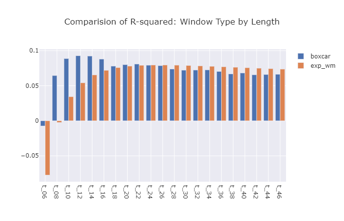

# FINM33150 - Predictive Regression

## Dependencies

Create a virtual environment and install dependencies with

    pipenv install

## Summary
In this assignment we create a two-stage regression model to predict the future weekly "returns" of five-year credit default swaps for 12 publicly traded, large-capitalization companies. The first stage entails creating contemporaneous models of the CDS "return" and stock price return and then calculating residuals. In the second stage, we create a model that predicts the CDS "return" residual based on the prior observation's equity return residual. Our period of analysis spans from 2018-01-03 to 2021-4-30.

The real world scenario here can be described as predicting a change in bond prices based on the prior observation's change in equity price. One thing that may limit the predictive power of our models is that we are using a full week as our period of analysis. Unless the timing of the change in equity price is such that it occurs at the end of a week, such that if there is a lag to the adjustment of the bond price, it is likely to occur in the subsequent period, our model won't pick it up if it occurs in the same period as the equity price adjustment.

### Contemporaneous Models

We model contemporaneous CDS "returns" as a function of stock price return and "return" an index of other CDS "returns", defined as the arithmetic average the CDS's of the other 11 companies in our universe. For each of these models we perform ordinary least squares regression for each ticker, for each contiguous 16 week period throughout our entire period of analysis. 

$$
r_{E}^{CDS} \sim r_{E}^{Equity} + r_{Index}^{CDS} + \epsilon
$$

We model contemporaneous equity returns as a function of the return on the market, defined as the return on SPY.

$$
r_{E}^{Equity} \sim r_{SPY}^{Equity} + \epsilon
$$

To predict the contemporaneous CDS return we end up with
$$
f_{E,n} = \beta_{E,n}^{Intercept} + \beta_{E,n}^{Equity} \cdot r_{E,n}^{Equity} + \beta_{E,n}^{Index} \cdot r_{E,n}^{Index}
$$

$$
g_{E,n} = \gamma_{E,n}^{Intercept} + \gamma_{E,n}^{SPY} \cdot r_{SPY,n}^{Equity}
$$

Contemporaneous residuals can the be defined as for CDS
$$
\rho_{E,n} = f_{E,n} - r_{E,n}^{CDS} 
$$

and

$$
c_{E,n} = g_{E,n} - r_{E,n}^{Equity} 
$$

### Predictive Model

Our predictive model then becomes

$$
\rho_{E,n} = c_{E,n-1} + \epsilon
$$

where we are lagging the equity residual back one observation from the CDS residual and using the various window methodologies and lengths described above to calculate the regression coefficients. Our model then becomes

$$
h_{E,n} = \mu_{E,n}^{Intercept} + \mu_{E,n} \cdot c_{E,n-1}
$$

and residuals can be defined as

$$
q_{E,n} = \rho_{E,n} - h_{E,n}
$$

### Analysis
Our job is to compare the performance of the predictive regressions from the exponentially weighted windows to those of the boxcar windows. We first compare the overall r-squared across all tickers for each window methodology and length. However, in the real world, it may be the case that certain combinations of window length and methodology may perform better for certain tickers. To that end, we analyze the r-squared for each ticker for each methodology and window length to identify the combination that performs best for each ticker.

Importantly, as is highlighted in the first set of asset performance charts below, the world changed at the outset of the pandemic and developing models that fit well across any period including the pandemic is going to be challenging. In order to get sense for how much more we can improve our model, we construct an alternate set of regression coefficients stopping just before the pandemic and compare their performance to the models developed from the entire time period.

As mentioned above, we try to improve the performance of our models by reducing the period of analysis from a week to a day, to see if the shorter duration results in a stronger evidence of a lagged relationship between changes in equity prices and changes in CDS spreads.

### Results

* The best combination of window methodology and length turned out to be a boxcar window with a length of 24 weeks and resulted in an overall $R^{2}$ of 0.093.

* By pulling out the best window methodology-length combination for each ticker were able to increase our overall $R^2$ to 0.131.

